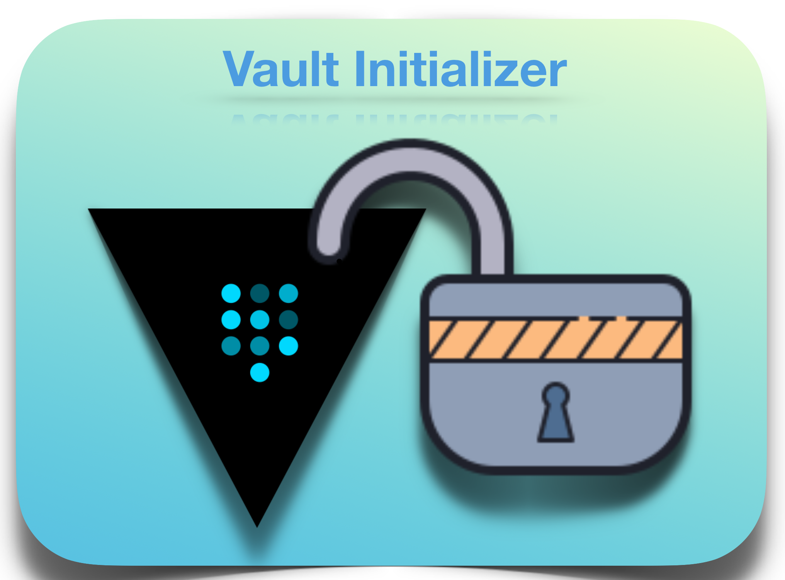

# Vault Initializer

**Vault Initializer** is a hacky way of obtaining HA of Vault service deployed with *Consul* as a storage backend. This is deployed as a deployment in kubernetes alongside the same namespace where the Vault pods are running. This is necessary as the *vault initializer* uses the pod's native IP address to directly communicate and makes the HA.



## Pre-requisite
There are few pre-requisites needed for this deployment to work properly. This service needs a config-map with certain values in a pre-defined format. The sample config map looks like

```yaml
apiVersion: v1
data:
  enableLDAP: |-
    {
      "type": "ldap",
      "description": "Login with LDAP"
    }
  readonly_r.hcl: |-
    path "pathone/*" {
      capabilities = ["read", "list"]
    }
  readwrite_rw.hcl: |-
    path "pathone/*" {
      capabilities = ["create", "read", "update", "delete", "list"]
    }
  ldapConfig: |-
    {
      "url": "ldap://ldapurl.com:389",
      "binddn": "uid=searchuser,OU=orgUnit,O=org.com,DC=domainComp,DC=domainComp2",
      "bindpass": "password",
      "userdn": "OU=orgUint,O=org.com,DC=domainComp,DC=domainComp2",
      "userattr": "uid",
      "groupdn": "ou=orgUnit,o=org.com,dc=domainComp,dc=domainComp2",
      "groupattr": "cn",
      "insecure_tls": true
    }
  ldapPolicyGroupMappings: |-
    {
      "groups": {
        "rw_groups": ["ldapGroup1", "ldapGroup2", "ldapGroup3"],
        "r_groups": ["ldapGroup4"],
        "r_users": ["ldapUser1"]
      },
    "policies": {
      "rw_policy": ["readwrite_rw"],
      "r_policy": ["readonly_r", "publickey_r"]
      }
    }
  publickey_r.hcl: |-
    path "publickey/*" {
      capabilities = ["read", "list"]
    }
  readinessProbeInSeconds: '5'
  secretEngines: |-
    {
      "keyvalengine": {
        "type": "kv",
        "description": "key value store 1",
        "config": {
          "default_lease_ttl": 0,
          "max_lease_ttl": 0,
          "force_no_cache": false,
          "seal_wrap": false
        }
      },
      "publickey": {
        "type": "kv",
        "description": "Public keys store as key value",
        "config": {
          "default_lease_ttl": 0,
          "max_lease_ttl": 0,
          "force_no_cache": false,
          "seal_wrap": false
        }
      }
    }
  secretShares: '5'
  secretThreshold: '3'
  serviceWaitTimeInSeconds: '3'
kind: ConfigMap
metadata:
  name: vault-init-configuration
```

The definition and usage of each field is tabulated below.

| S No | Field Name | Usage | Default |
|-- | -- | -- | -- |
| 1. | enableLDAP | used enable the LDAP auth method | `{ "type": "ldap", "description": "Login with DAP" }` |
| 2. | readonly_r.hcl | any hcl key are used as the policy in initializer; `readonly_r.hcl` is used to denote the read only policies for path `pathone/*` | `   path "pathone/*" { capabilities = ["read", "list"] }`|
| 3. | readwrite_rw.hcl | any hcl key are used as the policy in initializer; `readwrite_rw.hcl` is used to denote the read, list, write, update and delete policies for path `pathone/*` | `   path "pathone/*" { capabilities = ["create", "read", "update", "delete", "list"] }`|
| 4. | ldapConfig | used to configure the LDAP for vault login | - |
| 5. | ldapPolicyGroupMappings | used to map the ACL policies to the LDAP groups and/or users | |
| 6. | secretEngines | used to enable the given list of secret engines ||
| 7. | secretShares | used to define the total number of secret shares to be initialized | 5 |
| 8. | secretThreshold | used to define how many keys should make the master key in shamir's algo | 3 |
| 9. | serviceWaitTimeInSeconds | used to define the default wait time for the services | 3 |
